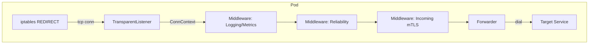

# Реализация sidecar

Этот документ описывает архитектурное ядро реализации. Подробные алгоритмы и длинные reference-сниппеты вынесены в профильные документы и приложение.

## Обзор архитектуры

Sidecar реализован на Go по паттерну middleware chain. Такой подход позволяет добавлять наблюдаемость, отказоустойчивость и безопасность без изменения терминального обработчика проксирования.



## Контракт middleware

```go
type ConnContext struct {
    Context     context.Context
    ClientConn  net.Conn
    OriginalDst string
    Metadata    map[string]any
}

type Handler interface {
    Handle(ctx *ConnContext, next func(*ConnContext) error) error
}
```

Правила контракта:

1. Middleware MUST либо вызвать `next`, либо вернуть ошибку и остановить цепочку.
2. Middleware MAY модифицировать `ConnContext` перед вызовом `next`.
3. Ошибка из `next` должна подниматься вверх по цепочке без потери контекста.

## Карта компонентов

| Компонент                | Ответственность                                                       | Подробности                                  |
| ------------------------ | --------------------------------------------------------------------- | -------------------------------------------- |
| TransparentListener      | Прием соединений и получение исходного назначения (`SO_ORIGINAL_DST`) | [Proxy](proxy.md)                            |
| Service Discovery        | LIST/WATCH EndpointSlice, актуализация кэша endpoint'ов               | [Обнаружение сервисов](service-discovery.md) |
| Forwarder                | Выбор endpoint и проксирование двунаправленного трафика               | [Балансировка нагрузки](balancing.md)        |
| Reliability Middleware   | Retry/timeout/circuit breaker для dial-этапа                          | [Отказоустойчивость](reliability.md)         |
| Incoming mTLS Middleware | Проверка клиентского сертификата на `inboundMTLSPort`                 | [Proxy](proxy.md)                            |
| Metrics Middleware       | Экспорт метрик sidecar на `/metrics`                                  | [Наблюдаемость](observability.md)            |
| Lifecycle Manager        | Запуск/остановка listener'ов, graceful shutdown                       | [Жизненный цикл](lifecycle.md)               |

## Профили listener'ов

| Профиль  | Порт               | Назначение                        | Специфика                  |
| -------- | ------------------ | --------------------------------- | -------------------------- |
| incoming | `inboundPlainPort` | Входящий plain-трафик             | REDIRECT из PREROUTING     |
| outgoing | `outboundPort`     | Исходящий трафик приложения       | REDIRECT из OUTPUT         |
| mtls     | `inboundMTLSPort`  | Входящий трафик от других sidecar | Прямой listen без REDIRECT |

## Поток обработки соединения

1. Listener принимает TCP-соединение и определяет `OriginalDst`.
2. Создается `ConnContext` и запускается middleware-цепочка.
3. Reliability middleware применяет retry/timeout/circuit breaker на dial-этапе.
4. Forwarder выбирает target endpoint и устанавливает соединение (mTLS для mesh endpoint'ов).
5. Выполняется двунаправленное копирование данных до завершения одной из сторон.

## Где смотреть подробности

- Нормативные требования MVP: [MVP Spec](mvp-spec.md)
- Длинные кодовые примеры: [Appendix: Code Snippets](appendix-code-snippets.md)

## См. также

- [README Sidecar](../README.md)
- [Proxy](proxy.md)
- [Жизненный цикл](lifecycle.md)
