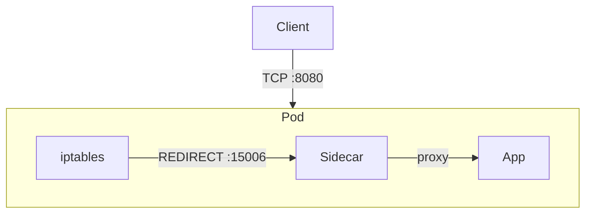
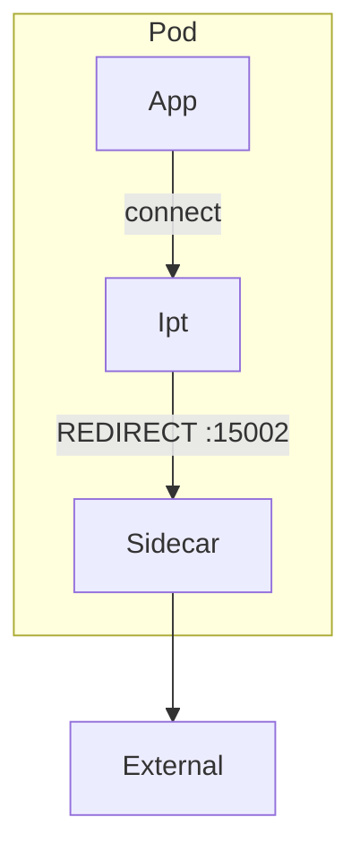
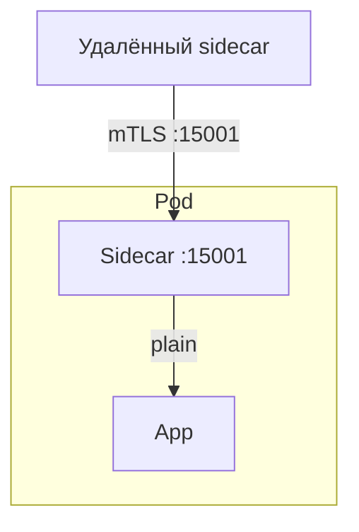

# Proxy

## Назначение

Sidecar прозрачно перехватывает TCP-трафик приложения и маршрутизирует его через три listener-порта. Документ задает контракт перехвата и mTLS-маршрутизации для MVP.

## Инициализация перехвата

Sidecar прозрачно перехватывает весь входящий и исходящий трафик приложения с помощью механизма iptables. В kubernetes эта настройка реализуется через init-контейнер, который настраивает правила перенаправления.

> [!IMPORTANT]
> Init-контейнер должен иметь `NET_ADMIN` capability.
> **Сам sidecar-контейнер должен запускаться под отдельным пользователем (например, `uid=1337`)** для корректной работы исключений в iptables.

Проксирование происходит на уровне TCP, что позволяет поддерживать широкий спектр протоколов (HTTP, gRPC, Thrift и т.д.) без необходимости дополнительной настройки. Также для обеспечения поддержки mTLS, сайдкар оборачивает трафик в TLS, что обеспечивает безопасность и шифрование данных между сервисами. Для реализации этого механизма используется роутинг на три порта: один для трафика от внешнего клиента, другой для исходящего трафика и третий для входящего mTLS трафика от сервисов.

Конфигурация портов задаётся в конфигурационном файле сайдкара и может быть изменена при необходимости через конфигурацию. Ниже приведены порты, используемые сайдкаром, их назначение и соответствующие переменные окружения:

| Назначение                                                                   | Переменная окружения | Значение по умолчанию | Название в конфигурации |
| ---------------------------------------------------------------------------- | -------------------- | --------------------- | ----------------------- |
| Порт для перехваченного **входящего** трафика от внешних клиентов (без mTLS) | `INBOUND_PLAIN_PORT` | 15006                 | `inboundPlainPort`      |
| Порт для перехваченного **исходящего** трафика от приложения                 | `OUTBOUND_PORT`      | 15002                 | `outboundPort`          |
| Порт для приёма **входящего mTLS** трафика от других sidecar'ов              | `INBOUND_MTLS_PORT`  | 15001                 | `inboundMTLSPort`       |

### Входящий трафик от внешнего клиента

Входящий трафик от внешнего клиента приходит от ingress контроллера без шифрования и перенаправляется на сайдкар для обработки.

Рассмотрим схему обработки входящего трафика. Пусть клиент отправляет запрос на приложение, которое работает на порту `8080`. Тогда трафик пройдёт через следующие этапы:

1. Клиент инициализирует запрос к приложению.
2. iptables перехватывает трафик
3. Происходит перенаправления трафика на сайдкар, где происходит дополнительная обработка (см. разделы ниже).
4. Сайдкар проксирует запрос на приложение, где происходит его обработка.



Достигается с помощью следующих правил iptables:

```bash
iptables -t nat -A PREROUTING -p tcp --dport <app-port> -j REDIRECT --to-port 15006
```

> [!NOTE]
> Использование REDIRECT изменяет destination IP, оригинальный IP клиента теряется. На уровне приложения источником запроса будет виден IP пода или 127.0.0.1. Для сохранения реального IP необходим механизм TPROXY, требующий дополнительных привилегий и более сложной реализации.

### Исходящий трафик

Рассмотрим схему обработки исходящего трафика. Пусть приложение отправляет запрос во внешний сервис. Тогда трафик пройдёт через следующие этапы:

1. Приложение инициализирует запрос во внешний сервис.
2. iptables перехватывает трафик
3. Происходит перенаправление трафика на sidecar, где выполняется выбор endpoint и, при необходимости, mTLS.
4. Сайдкар проксирует запрос во внешний сервис, где происходит его обработка. Выбор конечного сервиса выполняется на основе механизма обнаружения сервисов (см. раздел ["Обнаружение сервисов"](service-discovery.md#обнаружение-сервисов)).



Достигается с помощью следующих правил iptables:

```bash
# 1. Исключаем трафик самого сайдкара (петля)
iptables -t nat -A OUTPUT -m owner --uid-owner 1337 -j RETURN

# 2. Исключаем DNS (чтобы не блокировать разрешение имён)
iptables -t nat -A OUTPUT -p udp --dport 53 -j RETURN
iptables -t nat -A OUTPUT -p tcp --dport 53 -j RETURN

# 3. Исключаем локальный трафик (localhost)
iptables -t nat -A OUTPUT -d 127.0.0.0/8 -j RETURN

# 4. Перенаправляем всё остальное (или только сервисную сеть)
iptables -t nat -A OUTPUT -p tcp -j REDIRECT --to-port 15002
```

### Входящий mTLS трафик от сервисов

Входящий mTLS трафик от сервисов приходит на порт 15001 сайдкара, где происходит его обработка и проксирование на приложение.

> [!IMPORTANT]
> Правило iptables для порта 15001 не требуется. Sidecar слушает этот порт напрямую, трафик от других сервисов попадает на него через сетевой стек pod.

> [!IMPORTANT]
> Входящие соединения на `inboundMTLSPort` MUST проходить mutual TLS с проверкой сертификата клиента.

Схема взаимодействия для mTLS (без вмешательства iptables):



## SO_ORIGINAL_DST и TransparentListener

Для исходящего и inbound-plain трафика sidecar получает исходный адрес назначения через `SO_ORIGINAL_DST`.

- Если `SO_ORIGINAL_DST` успешно прочитан, sidecar использует его как ключ маршрутизации.
- Если чтение не удалось, sidecar использует fallback на локальный адрес сокета и логирует ошибку.
- В MVP поддерживается IPv4-путь для transparent proxy.

Подробные reference-сниппеты см. в [Appendix: Code Snippets](appendix-code-snippets.md#so_original_dst-и-transparentlistener).

## Правила mTLS для исходящего трафика

- Если целевой endpoint найден в service-discovery кэше, sidecar рассматривает его как mesh-внутренний и использует исходящее mTLS.
- Если endpoint не найден (внешний адрес), sidecar использует обычный TCP-dial без mTLS.
- Проверка сертификата сервера выполняется по доверенному CA.

## Исключения проксирования

Иногда может возникать необходимость вывести определённые порты или внешние ip адреса из редиректа. Например, если приложение предоставляет метрики на порту `9090`, то нужно исключить этот порт из перехвата, чтобы не нарушать работу мониторинга. Это достигается с помощью следующих правил iptables:

```bash
# Исключаем указанные порты из перехвата для входящего трафика
iptables -t nat -A PREROUTING -p tcp --dport 9090 -j RETURN
# Исключаем указанные ip адреса из перехвата для исходящего трафика
iptables -t nat -A OUTPUT -d 192.168.1.100 -j RETURN
```

```yaml
sidecar:
  excludeInboundPorts: "9090,9091" # Порты, которые не будут перехватываться для входящего трафика
  excludeOutboundIPs: "192.168.1.100,192.168.1.101" # IP адреса, которые не будут перехватываться для исходящего трафика
```

> [!IMPORTANT]
> `metricsPort` MUST входить в `excludeInboundPorts`, иначе endpoint `/metrics` может быть зациклен через REDIRECT.

## См. также

- [MVP Spec](mvp-spec.md)
- [Жизненный цикл](lifecycle.md)
- [Обнаружение сервисов](service-discovery.md)
- [Балансировка нагрузки](balancing.md)
